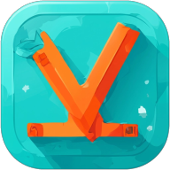

# Vocab Kids



[](LICENSE)
[](https://jerrywang121.github.io/vocab-kids/)
[](https://github.com/jerrywang121/vocab-kids)


VocabKids lets children (and their parents/teachers) easily build custom word decks with the help of AI, practise with animated flashcards, test their knowledge with auto-generated quizzes, and play word games. Everything runs in the browser and persists in `localStorage` — no server, no sign-up.

> *... OK, it is for my son, who is doing 11+, having 1000+ words on his list that he seems never want to look at. Built this to help him "gaming" on it... hope it works. If you have the same experience, feel free to [try it out](https://jerrywang121.github.io/vocab-kids/)!*


---

## ✨ Features

- **PWA — install as app** — add to home screen on Android / iOS / Desktop; works offline
- **Flashcard decks** — create, edit, and colour-code unlimited decks
- **Smart learning mode** — flip cards, mark *Got it* / *Keep practising*; cards are prioritised by a time-decay score so weaker words surface more often
- **Mixed quizzes** — three question types generated automatically:
  - Definition Quiz (pick the right meaning)
  - Synonym / Antonym Quiz
  - Fill-the-Gap (complete a real example sentence)
- **Word games** — three fun games to reinforce vocabulary:
  - 🪢 **Hangman** — guess the word letter by letter
  - 🔤 **Word Scramble** — rearrange shuffled letter tiles to spell the word
  - ⚡ **Speed Spell** — read the definition and type the word before time runs out
- **AI enrichment** — paste a word list and have 17+ AI providers fill in definitions, synonyms, antonyms, inflected forms, and example sentences
- **Dictionary API** — free fallback enrichment via [dictionaryapi.dev](https://dictionaryapi.dev/) (no key needed)
- **Text-to-speech** — hear words and sentences read aloud (Web Speech API)
- **Achievements** — progress bars and a daily-snapshot line chart per deck
- **Age-group modes** — AI adapts content complexity for ages 3–5, 6–8, 9–11, and 12+
- **Dark mode** — light / dark / auto (follows OS preference)
- **5 colour themes** — Pink, Blue, Green, Purple, Orange
- **Import / Export** — back up and restore all data as a single JSON file
- **Cloud Backup & Sync** — connect your Google account to automatically back up data to Google Drive and keep multiple devices in sync
- **Bulk word import** — paste a plain text list or upload a `.txt` / `.csv` / `.json` file

---

## 🚀 Getting Started

### Prerequisites

- [Node.js](https://nodejs.org/) 18 or later
- npm (bundled with Node)

### Install & run

```bash
git clone https://github.com/jerrywang121/vocab-kids.git
cd vocab-kids
npm install
npm run dev
```

Open **http://localhost:5173** in your browser.

### Other commands

```bash
npm run build    # production build → dist/
npm run preview  # serve the production build locally
```

---

## 📱 Install as App (PWA)

VocabKids is a **Progressive Web App** — no app store needed.

1. Open the [GitHub Pages](https://jerrywang121.github.io/vocab-kids/) in Chrome (Android) or Safari (iOS)
2. Tap **"Add to Home Screen"** from the browser menu
3. An icon appears on your home screen — it opens fullscreen, just like a native app

Works offline once installed. All data stays on-device via `localStorage`.

---

## ☁️ Google Drive Sync Setup

To enable the Google Drive backup feature in your own deployment:

1. Go to the [Google Cloud Console](https://console.cloud.google.com/).
2. Create a new project and enable the **Google Drive API**.
3. Configure the **OAuth Consent Screen** (External) and add the `.../auth/drive.file` scope.
4. Create an **OAuth 2.0 Client ID** for a **Web Application**.
5. Add your domain (e.g., `http://localhost:5173`) to **Authorized JavaScript origins**.
6. Set your Client ID as `VITE_GOOGLE_CLIENT_ID` in your `.env` file or GitHub Secrets.

---

## 🗂️ Project Structure

```
lingokids-local/
├── public/
│   ├── avatars/          # PNG avatar images
│   ├── pwa-192x192.png   # PWA icon (home screen)
│   ├── pwa-512x512.png   # PWA icon (splash / maskable)
│   └── apple-touch-icon.png  # iOS home screen icon
├── src/
│   ├── main.js           # app entry point
│   ├── App.vue           # root: theme + dark-mode binding
│   ├── router/           # Vue Router (hash mode, 7 routes)
│   ├── stores/           # Pinia stores (auto-persisted to localStorage)
│   │   ├── useDecksStore.js
│   │   ├── useCardsStore.js
│   │   ├── useProgressStore.js
│   │   └── useSettingsStore.js
│   ├── views/            # one component per route
│   │   ├── HomeView.vue
│   │   ├── ManageView.vue
│   │   ├── LearnView.vue
│   │   ├── QuizView.vue
│   │   ├── GamesView.vue       ← Hangman, Word Scramble, Speed Spell
│   │   ├── AchievementsView.vue
│   │   └── SettingsView.vue
│   ├── components/       # reusable UI components
│   ├── composables/
│   │   ├── useGoogleSync.js # google drive sync up
│   │   └── useSpeech.js     # Web Speech API wrapper
│   ├── api/
│   │   ├── dictionary.js   # dictionaryapi.dev wrapper
│   │   ├── ai.js           # enrich / convert / quiz / listModels
│   │   ├── providers.js    # registry of 17+ AI provider configs
│   │   └── googleDrive.js  # Wrapper for Google Drive and GIS API
│   ├── quiz/
│   │   ├── generator.js  # score-weighted quiz session builder
│   │   └── types.js      # question factories
│   ├── utils/uuid.js
│   └── assets/main.css   # CSS custom properties + theme classes
└── docs/design.md        # detailed design document
```

---

## 🤖 AI Provider Setup

VocabKids supports 17+ AI providers for card enrichment and quiz generation. Configure in **Settings → AI**.

| Provider | Notes |
|---|---|
| **OpenAI** | `gpt-4o-mini` default; any GPT / o-series model |
| **Anthropic** | `claude-3-5-haiku` default |
| **Google Gemini** | OpenAI-compatible endpoint |
| **OpenRouter** | Access hundreds of models with one key |
| **Groq** | Fast inference, free tier available |
| **Ollama (Local)** | Fully local; no API key needed |
| **Mistral, xAI, DeepSeek, Together AI, Fireworks, Perplexity, Venice, Cohere, MiniMax** | Supported |
| **Azure OpenAI / Vertex AI** | Supply your endpoint URL |
| **Custom / Self-hosted** | Any OpenAI-compatible endpoint |

> All AI calls are optional. The app is fully usable without any AI key — the free Dictionary API covers the basics.

**Rate limiting:** configure a max calls-per-minute in Settings (default 10; 0 = unlimited).

---

## 📦 Data Model

### FlashCard

```jsonc
{
  "id": "uuid",
  "word": "run",
  "partOfSpeech": "verb",
  "forms": {
    "Past Tense": "ran",
    "Past Participle": "run",
    "Present Participle": "running",
    "3rd Person Singular": "runs"
  },
  "definition": "To move quickly on foot.",
  "synonyms": ["sprint", "dash", "jog"],
  "antonyms": ["walk", "crawl"],
  "exampleSentence": "She likes to run in the park every morning.",
  "deckId": "uuid",
  "createdAt": "2025-01-15T10:00:00Z"
}
```

### Backup / Import format

```jsonc
{
  "version": 1,
  "exportedAt": "2025-01-15T10:00:00Z",
  "decks": [...],
  "cards": [...],
  "progress": [...]
}
```

Import merges by `id`; newer progress entries win on conflict.

---

## 🗺️ Routes

| Path | Screen |
|---|---|
| `/` | Home — avatar, name, quick links |
| `/manage` | Deck & card management, bulk import |
| `/learn` | Flashcard learning mode |
| `/quiz` | Quiz flow + results |
| `/games` | Word games hub (Hangman, Word Scramble, Speed Spell) |
| `/achievements` | Progress bars & charts |
| `/settings` | All user preferences |

---

## 🛠️ Tech Stack

| Concern | Choice |
|---|---|
| Framework | Vue 3 (`<script setup>`) |
| Build | Vite |
| Routing | Vue Router 4 (hash history) |
| State | Pinia + `pinia-plugin-persistedstate` |
| Charts | Chart.js + `vue-chartjs` |
| Styling | CSS3 custom properties |
| Storage | `localStorage` (via Pinia plugin) |
| TTS | Web Speech API |
| PWA | `vite-plugin-pwa` + Workbox (offline, installable) |

---

## 📝 License

MIT — see [LICENSE](LICENSE) for details.
